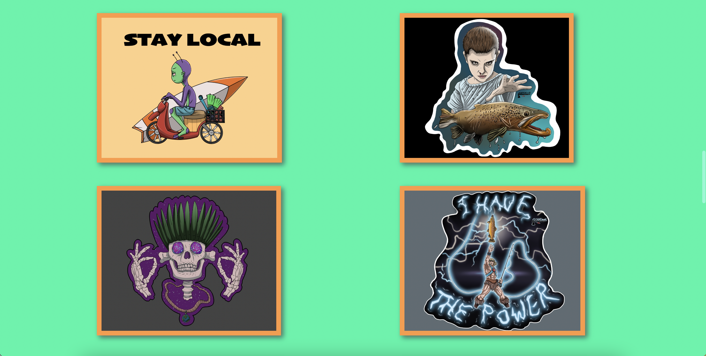
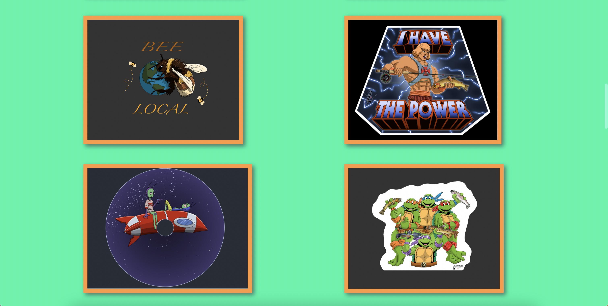

# Graphic Design Portfolio

# Overview

This is one of my First Projects. I built this website for my younger brother to help him with his graphic design business called Chimichanga Studios

- [Click this link to brouse the website](https://enchiladastyle.github.io/wdd130/Chimichanga/index.html)

My purpose in making this was to help my brother and to practice HTML/CSS web development

# Development Environment

The program is written entirely in HTML and CSS.

