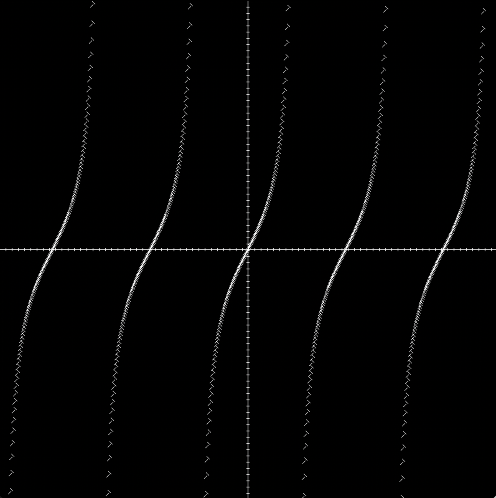

# Personal Software Portfolio
A collection of some of my favorite projects. View code and video demonstrations by clicking the links.

# Sorting Algorithm Animator:

Written in Java. Lets the user choose between an assortment of Algorithms to race against each other.

[Click here to learn about the Sorting Algorithm Program](./SortingAlgorithm/)

# Multithreaded Maze Solver:

Written in C++. Uses multithreading to search multiple paths at once. Marks the correct path when found.

[Click here to learn about the Multithreaded Maze Solver](./mazeSolver/)

# Tour Bus Dispatch Generator:

Built for a real tour bus company in Alaska. Solves the Vehicle Routing Problem with time window, vehicle capacity, and pickup/delivery constraints. Created with Google OR Tools, SQLite, Microsoft Excel, openPyXL, and wxPython. Deployed with pyInstaller

[Click here to learn about the Tour Bus Dispatch Generator](./TourBusDispatchGenerator)

# Visual Graphing Calculator:

Written in C++. Takes an equation as input and then displays the graph.

[Click here to learn about the Visual Graphing Calculator](./GraphingCalculator/)

# Typing Practice Program:

Full stack web application. Records and displays typing speed and accuracy. Saves User data into a database and allows users to sign in to view previous stats and compete with others

[Click here to learn about the Full Stack Typing Practice Program](./typing_project/)

# Graphic Design Portfolio Website:

One of my first projects. I built this for my brother. It Showcases his personal and professional work as a graphic designer.

[Click here to learn about the Graphic Design Portfolio Website](./Chimichanga/)

# Data Structures Tutorial:

Teaches the user how to implement data structures in Python.

[Click here to learn about the Python/Markdown Data Structures Tutorial](./DataStructuresTutorial/)

# Online Graphing Calculator:

Allows users to graph their equations, and also sign in to view and manage previous work. Uses React and Node.

[Click here to learn about the Online Graphing Calculator](./OnlineGraphingCalculator/)