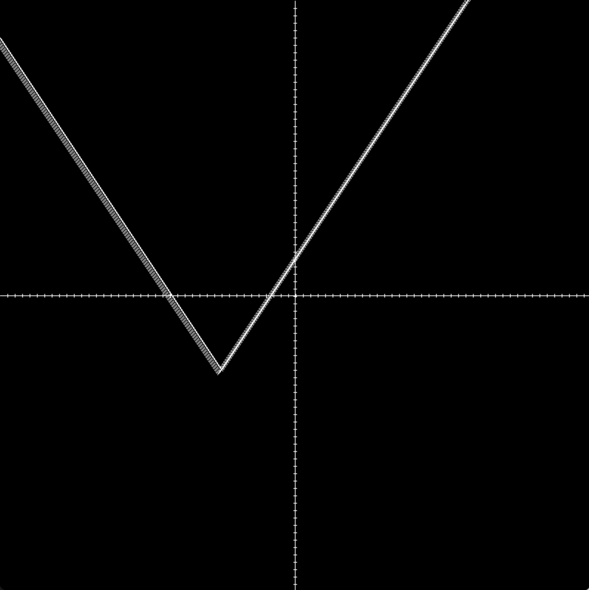
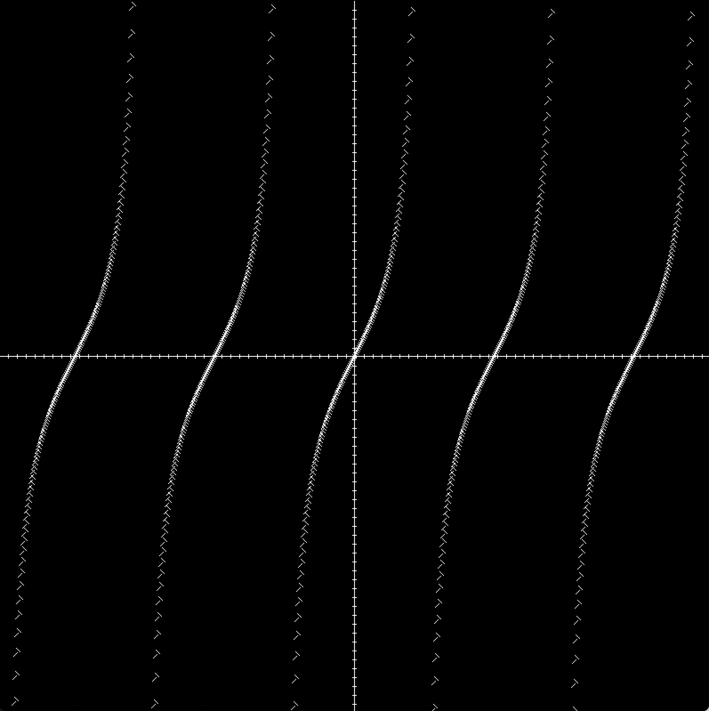

# Visual Graphing Calculator

# Overview

The Visual Graphing Calculator takes input from the user as an equation and then displays the equation on a graph. The compatible equations include linear, quadratic, absolute value, sin, and tangent.

The purpose of this project was to demonstrate my skills with the C++ programming language, as well as my understanding of Object Oriented Programming.

The Code applies Object Oriented Programming concepts, such as Abstraction, Encapsulation, and Inheritance. It applies C++ best practices such as correct naming conventions and separating classes into files.

[Software Demo Video](https://us06web.zoom.us/rec/share/YqVxKYFJ1pkpHedOYRGfWK72mYiph7xyRjjW_O6RvDqyYby64nobYXEJm1mKRITD.CpcUHFmE6bIQpR7C?startTime=1698197367000)

# Development Environment

The program is written entirely in C++ using the SDL2 Library to create the window.

I mainly used visual studio code as the IDE for this project.

# Useful Links

- [Girraffe Academy Youtube](https://www.youtube.com/watch?v=vLnPwxZdW4Y&t=4953s)
- [Khan Academy](https://www.khanacademy.org/math/algebra2/x2ec2f6f830c9fb89:transformations)
- [W3Schools](https://www.w3schools.com/cpp/)

# Future Work

- Use polymorphism to clean up some of the code
- Add more functions for the users to play around with.
