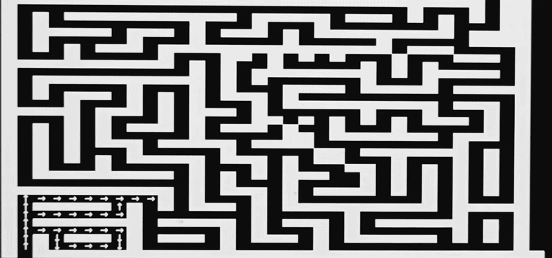
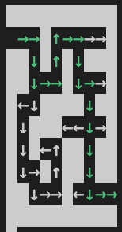
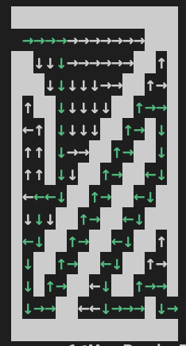
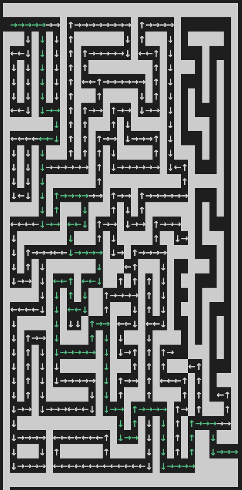

# Multithreaded Maze Solver

# Overview

This Program Uses multithreading to search multiple paths at once through a maze. When it finds the end it marks the successful path in green. There are three mazes so far, but the algorithm would work with any maze given to it.

The purpose of this project was to practice C++ and multithreading

[Software Demo Video](https://us06web.zoom.us/rec/share/a-q_3bW8ge_3BDg05EPVE8GjP-6RfrkM3pEEx8lrsG0lNONVr-gsLNPPcMDzJEHA.WygpP3fwMwTrbhTw?startTime=1729049506000)

# Development Environment

This program was written entirely in C++. 

The gcc compiler was used.

